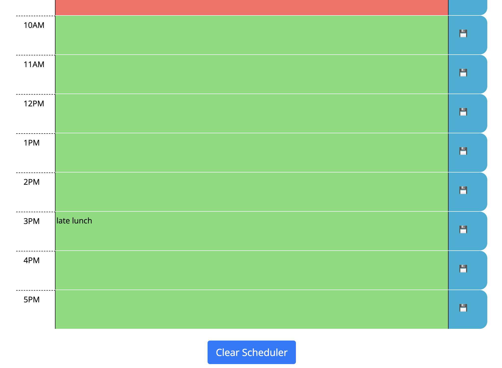

# Work Day Scheduler

## Description

This is a simple calendar application that allows an employee with a busy schedule to add important events to a daily planner, so that his time will be managed effectively. The standard business hours are represented as time blocks, which are color-coded to indicate whether they are in the past, present, or future. 

The user can click on a time block to enter an event and press save. The events are stored in local storage.  User can clear the events by clicking on the Clear button.  

---

## Usage

To visit site, navigate to the following HTTP address:

[https://mikeyboxx.github.io/work-day-scheduler/](https://mikeyboxx.github.io/work-day-scheduler/)

---

## Screenshot

The following images show the web application's appearance and functionality:

---

